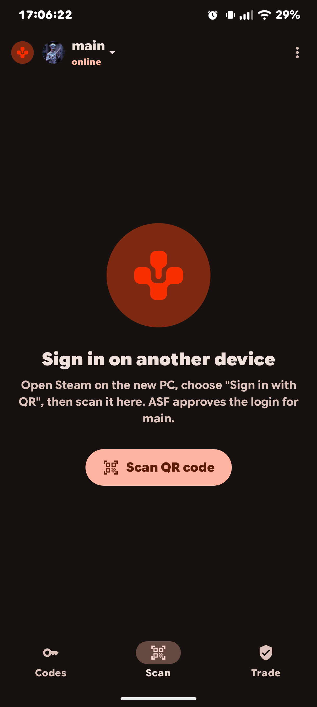
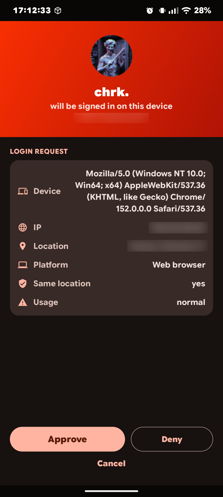
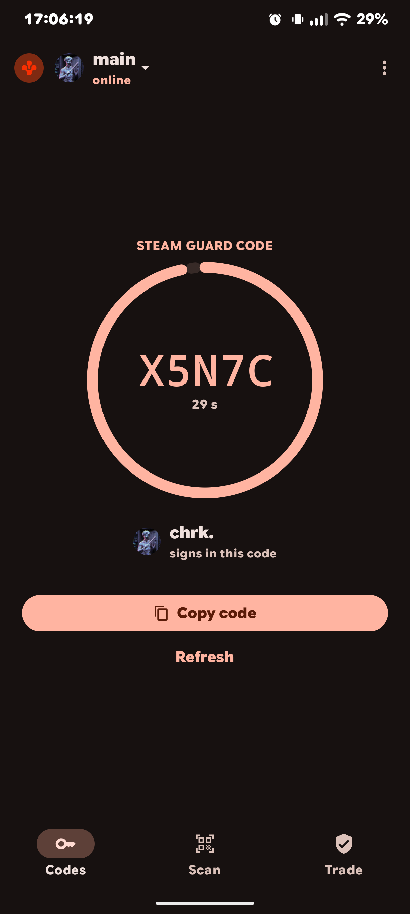
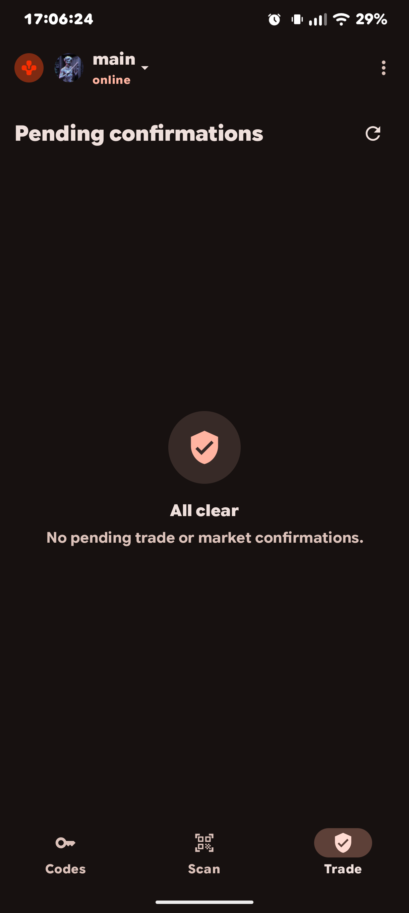

<p align="center">
  
</p>

<h1 align="center">Steam ASF 2FA</h1>

<p align="center">Use <a href="https://github.com/JustArchiNET/ArchiSteamFarm">ArchiSteamFarm</a> as your Steam
authenticator, from your phone.</p>

An ASF plugin plus an Android app. The app approves **QR logins**, handles **trade confirmations** and shows
**Steam Guard codes** for the accounts ASF is already logged into. It works **only through the app** — no web
interface.

> ⚠️ This project is **vibe-coded** (built with heavy AI assistance). It works, but review it before trusting it
> with your accounts.
>
> 🔒 **Use it on your LAN.** Point the app at ASF's LAN IP (e.g. `192.168.x.x:1242`), not a public address.
> Expose the ASF IPC to the internet only behind a tunnel plus ASF's `IPCPassword`.

## Screenshots

<p align="center">
  
  
  
  
</p>

## Why use it

- **Many accounts.** If ASF manages several Steam accounts, this gives you one place to approve QR logins, clear
  trade confirmations and read 2FA codes for all of them — instead of juggling the Steam app per account.
- **No root, no key extraction.** Getting a second authenticator usually means rooting the phone to pull the
  `shared_secret` out of the Steam app. Here ASF already holds it (ASF 2FA), so the phone only needs this app —
  no root, no extraction.

## Download

- **Android app:** [latest APK](https://github.com/cchrkk/Steam-ASF-2FA/releases/latest/download/SteamASF2FA.apk)
- **ASF plugin (DLL):** [latest `SteamASF2FA.zip`](https://github.com/cchrkk/Steam-ASF-2FA/releases/latest/download/SteamASF2FA.zip)

## Install

**Plugin** — unpack the plugin zip into `plugins/SteamASF2FA/` inside your ASF folder:

```
plugins/SteamASF2FA/SteamASF2FA.dll
```

Use the **generic** ASF build: OS-specific builds are trimmed and remove .NET methods a plugin may need (the plugin
will throw `MissingMethodException`). Docker note: run the generic build on a full .NET runtime
(`mcr.microsoft.com/dotnet/aspnet:10.0`), not the trimmed `justarchi/archisteamfarm` image.

**App** — install the APK on a phone on the same network as ASF.

## Pairing & usage

Open the app and enter, once:

- **ASF address**: your ASF IPC address, e.g. `192.168.1.x:1242` (LAN IP — see the note above).
- **IPCPassword**: your ASF IPC password.
- **Device name**.

The app pairs and stores its own **device token** (the IPCPassword is not kept). The account is chosen from the top
bar (logo + account name → dropdown). Three tabs:

- **Codes** — current Steam Guard code, with a countdown.
- **QR** — tap *Start camera*, scan the QR shown by the device you want to sign in; ASF shows the account being
  signed in (avatar, name), the IP and location — then Approve or Deny.
- **Trade** — pending trade confirmations; *Show items* expands the offer contents (item names, icons, amounts).

*Unpair* lives in the top-right menu.

## Auto-updates & releases

The plugin implements ASF's built-in plugin updates (`IGitHubPluginUpdates`). To let ASF update it automatically:

```jsonc
{
	"PluginsUpdateMode": true,
	"PluginsUpdateList": ["cchrkk/Steam-ASF-2FA"]
}
```

> ⚠️ **Auto-updates run code from releases automatically.** Enable them only for repositories you trust: a
> compromised release (or CI action) executes inside your ASF process, with access to every bot. This repo's
> releases ship a `SHA256SUMS` you can verify.

Releases are built **against a specific ASF version**, and the plugin and the app share a version independent of ASF
(so every build is a new version). The release notes state which ArchiSteamFarm version it was built against and list
the changes since the previous release. A daily GitHub Action checks for a new ArchiSteamFarm release and, when there
is one, rebuilds and publishes, so it stays compatible without manual work.

## Build from source

**Plugin** — needs an ASF runtime to compile against (download `ASF-generic.zip` and unpack into `./asf`, or point
`ASFPath` at a folder containing `ArchiSteamFarm.dll`):

```shell
dotnet build QrLoginApprover -c Release
```

**App** — Kotlin + Jetpack Compose, CameraX + ML Kit:

```shell
cd app-android
./gradlew :app:assembleDebug     # APK in app/build/outputs/apk/debug/
```

## Security

- The plugin is loaded **into the ASF process** and can do anything ASF can. Only run plugins you trust.
- To sign confirmations, the plugin needs the account's TOTP `shared_secret`, which ASF keeps private with no public
  accessor — so the plugin reads it via **reflection**. This is why a plugin is required, and why it is inherently
  privileged.
- The pairing endpoint is protected by ASF's `IPCPassword`; everything else uses per-device tokens (only their SHA-256
  hashes are stored, in `config/SteamASF2FA/devices.json`).
- Keep it on your **LAN** as noted above.

## API

See [`docs/API.md`](docs/API.md).

## License

MIT — see [LICENSE](LICENSE). Community project, not affiliated with or supported by the ArchiSteamFarm project.
